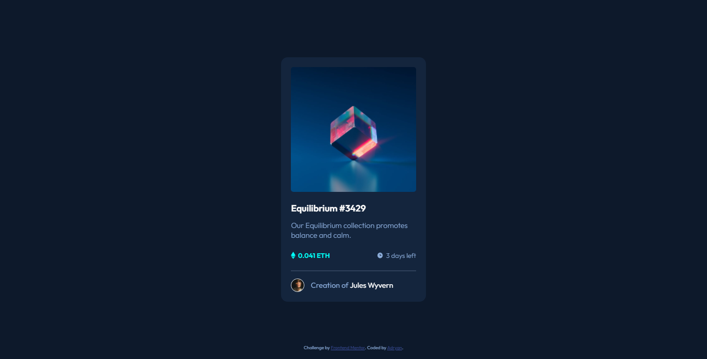

# Frontend Mentor - NFT preview card component solution

This is a solution to the [NFT preview card component challenge on Frontend Mentor](https://www.frontendmentor.io/challenges/nft-preview-card-component-SbdUL_w0U). Frontend Mentor challenges help you improve your coding skills by building realistic projects.

A pretty good dark theme layout to code, using only HTML and CSS.

## Overview

### The challenge

Users should be able to:

- View the optimal layout depending on their device's screen size
- See hover states for interactive elements

### Screenshot

### Links

- Live Site URL: [NFT preview card](https://your-live-site-url.com)

### Built with

- HTML
- CSS
- Flexbox

## Author

- Frontend Mentor - [@iranadryan](https://www.frontendmentor.io/profile/iranadryan)
- LinkedIn - [iranbatista](https://www.linkedin.com/in/iranbatista/)